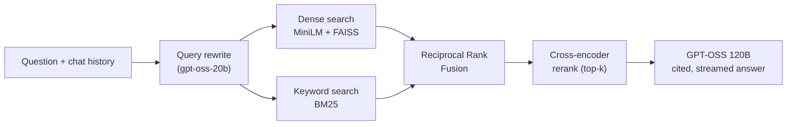

# 📄 RAG Chatbot

[](https://github.com/animesh750/rag-chatbot/actions/workflows/ci.yml)

Chat with your PDFs using **hybrid retrieval** (semantic + keyword search), **cross-encoder reranking**, page-level citations and streaming answers. Ships as a Streamlit app _and_ a production-style FastAPI service, with an evaluation harness, tests, CI, Docker and Prometheus metrics. Built on free, open-source tools plus the Groq free tier.

## 🚀 Live Demo

[View on Streamlit Cloud](https://your-app-url.streamlit.app) <!-- TODO: replace with your real Streamlit Cloud URL -->

## ✨ Features

|                        |                                                                                            |
| ---------------------- | ------------------------------------------------------------------------------------------ |
| 🔀 **Hybrid search**   | Dense embeddings (FAISS) + BM25 keyword search, merged with Reciprocal Rank Fusion         |
| 🎯 **Reranking**       | Optional cross-encoder re-scores the top candidates for precision                          |
| 📑 **Page citations**  | Every chunk knows its page; answers cite sources inline as `[1]`, `[2]` with file and page |
| 🧠 **Follow-up aware** | A small LLM rewrites "what about its limits?" into a standalone search query               |
| ⚡ **Streaming**       | Token-by-token answers in the UI and over Server-Sent Events in the API                    |
| 🔌 **FastAPI backend** | Upload / search / query / stream endpoints, API-key auth, persistent index                 |
| 📊 **Observability**   | JSON logs with request IDs, per-stage latency, token usage, Prometheus `/metrics`          |
| 🧪 **Evaluation**      | 32-question benchmark with Hit@k / MRR per search mode, plus optional LLM-as-judge         |
| 🗂️ Multi-document      | Search across many PDFs, or scope a question to specific ones                              |
| 📥 Export              | Download the conversation (with citations) as PDF                                          |

## 🏗️ How it works



**Why hybrid?** Embeddings capture _meaning_ ("why do chatbots answer differently each time?") but can miss exact tokens such as `GPT3`, `Word2Vec` or `175 billion`. BM25 is the opposite: excellent on exact terms, blind to paraphrase. Their scores live on different scales, so they are merged by **rank** with RRF: `score(d) = Σ 1 / (60 + rank_i(d))`.

**Design decisions worth knowing**

- **Page-aware chunking.** Pages are chunked separately (500 chars, 50 overlap) so each chunk keeps its page number.
- **Always-positive BM25 IDF.** `rank_bm25`'s classic IDF is 0 when a term appears in exactly half the chunks, which silently disables keyword search on small documents. The retriever uses the Lucene/Elasticsearch formula instead (regression-tested).
- **Cheap deletes.** Embeddings are stored, so removing a document rebuilds the indexes without re-encoding anything.
- **Graceful degradation.** If rewriting or reranking fails, the query still succeeds using the simpler path.
- **Prompt-injection hygiene.** Retrieved passages are labelled untrusted in the system prompt.

## 📦 Quick start

```bash
git clone https://github.com/animesh750/rag-chatbot
cd rag-chatbot
python -m venv venv
venv\Scripts\activate          # Windows  (macOS/Linux: source venv/bin/activate)
pip install -r requirements.txt
copy .env.example .env         # Windows  (macOS/Linux: cp)  then add your GROQ_API_KEY (free key: console.groq.com)
streamlit run app.py
```

**Deploying to Streamlit Cloud?** Add `GROQ_API_KEY` under _Secrets_. Free-tier memory is tight, so if the app restarts when you enable reranking, add `DEFAULT_RERANK = "false"` to the secrets too (root-level secrets are exposed as environment variables) and switch reranking on from the sidebar only when you need it.

### Run the API

```bash
pip install -r requirements-api.txt
python ingest.py docs/genai-principles.pdf      # optional: pre-load documents
uvicorn api:app --reload                        # interactive docs: http://localhost:8000/docs
```

```bash
# upload a PDF
curl -F "file=@docs/genai-principles.pdf" http://localhost:8000/documents

# retrieval only (no LLM call, no API key needed)
curl -X POST localhost:8000/search -H "Content-Type: application/json" \
  -d '{"question": "How many parameters does GPT3 have?", "mode": "hybrid", "k": 3}'

# full RAG answer with citations and timings
curl -X POST localhost:8000/query -H "Content-Type: application/json" \
  -d '{"question": "Why do chatbots give different answers to the same prompt?", "rerank": true}'

# streaming (Server-Sent Events: meta -> token... -> done)
curl -N -X POST localhost:8000/query/stream -H "Content-Type: application/json" \
  -d '{"question": "What is in-context learning?"}'
```

| Endpoint                                                          | Purpose                                                          |
| ----------------------------------------------------------------- | ---------------------------------------------------------------- |
| `POST /documents` · `GET /documents` · `DELETE /documents/{name}` | Manage the index (persisted to `DATA_DIR`)                       |
| `POST /search`                                                    | Retrieval only: ranked passages with per-method ranks and scores |
| `POST /query`                                                     | Answer + citations + stage timings + token usage                 |
| `POST /query/stream`                                              | Same, streamed over SSE                                          |
| `GET /health` · `GET /metrics`                                    | Liveness and Prometheus metrics                                  |

Set `API_KEY` in the environment to require an `X-API-Key` header on everything except `/health` and `/metrics`.

### Docker

```bash
docker compose up --build                        # API :8000 + Streamlit UI :8501
docker compose --profile monitoring up --build   # + Prometheus :9090
```

Images use CPU-only PyTorch and bake in the model weights, so containers start fast and need no download at runtime.

## 📊 Evaluation

`evaluation/dataset.jsonl` holds 32 questions over `docs/genai-principles.pdf`, each with a gold evidence phrase (a chunk is relevant if it contains it, so the benchmark survives changes to chunk size). Half are **lexical** (names, numbers, acronyms) and half are **paraphrased** (little word overlap with the source), because that is exactly where the search modes differ.

```bash
python -m evaluation.run_eval                        # bm25, dense, hybrid, hybrid+rerank
python -m evaluation.run_eval --judge                # also grade answer faithfulness/correctness (needs GROQ_API_KEY)
python scripts/update_readme_results.py              # paste the table below
```

<!-- EVAL-RESULTS-START -->

_32 questions over `genai-principles.pdf` · 55 chunks · chunk size 500/50 · run on 2026-10-07_

| Configuration | Hit@1         | Hit@3 | Hit@5 | MRR@5 | Hit@3 (lexical) | Hit@3 (paraphrase) |
| ------------- | ------------- | ----- | ----- | ----- | --------------- | ------------------ |
| bm25          | 50%           | 75%   | 81%   | 0.625 | 100%            | 50%                |
| dense         | _run locally_ |       |       |       |                 |                    |
| hybrid        | _run locally_ |       |       |       |                 |                    |
| hybrid+rerank | _run locally_ |       |       |       |                 |                    |

<!-- EVAL-RESULTS-END -->

_Read this honestly:_ it is a single 12-page document and 32 questions, so treat differences of a few points as noise. The BM25 row is the keyword-only baseline: perfect on lexical questions, but it misses the top 5 on 6 of the 16 paraphrased ones. The dense, hybrid and reranked rows need the model downloads, so run the command above to fill them in.

CI runs the BM25 benchmark on every push and fails if Hit@3 drops below 65%, so a tokenizer change that hurts retrieval can't merge unnoticed.

## 🔭 Observability

- **Logs:** one JSON line per request and per query, with `request_id`, stage timings and token counts (question text is _not_ logged, only its length).
- **Metrics at `/metrics`:** `rag_http_requests_total`, `rag_http_request_duration_seconds`, `rag_stage_latency_seconds{stage=rewrite|retrieve|rerank|generate}`, `rag_queries_total{mode,rerank}`, `rag_llm_tokens_total`, `rag_llm_errors_total`, `rag_indexed_documents`, `rag_indexed_chunks`.
- Every `/query` response includes `timings_ms` so you can see where latency goes.

## 🗂️ Project structure

```
app.py                  Streamlit UI
api.py                  FastAPI service
ingest.py               CLI: index PDFs into the persistent store
rag/
  loader.py             PDF -> page-aware chunks
  retriever.py          FAISS + BM25 + RRF + rerank, persistence
  embeddings.py         SentenceTransformer / CrossEncoder wrappers (lazy-loaded)
  llm.py                Groq client: rewrite, cited prompts, streaming, retries
  pipeline.py           rewrite -> retrieve -> rerank -> generate, with timings
  observability.py      JSON logging + Prometheus metrics
  export.py             chat -> PDF
evaluation/             benchmark dataset + runner
tests/                  pytest suite (no model downloads, no network)
Dockerfile · docker-compose.yml · observability/prometheus.yml · .github/workflows/ci.yml
```

## ⚙️ Configuration

All optional, set in `.env` or the environment (see `.env.example`).

| Variable                          | Default                                                     |                                         |
| --------------------------------- | ----------------------------------------------------------- | --------------------------------------- |
| `GROQ_API_KEY`                    | –                                                           | Required for answers                    |
| `LLM_MODEL` / `REWRITE_MODEL`     | `openai/gpt-oss-120b` / `openai/gpt-oss-20b`                | Answer model / small follow-up rewriter |
| `EMBED_MODEL` / `RERANK_MODEL`    | `all-MiniLM-L6-v2` / `cross-encoder/ms-marco-MiniLM-L-6-v2` |                                         |
| `DEFAULT_MODE` / `DEFAULT_RERANK` | `hybrid` / `true`                                           |                                         |
| `CHUNK_SIZE` / `CHUNK_OVERLAP`    | `500` / `50`                                                |                                         |
| `API_KEY`                         | –                                                           | Enables API key auth                    |
| `DATA_DIR`                        | `data/index`                                                | Where the API persists its index        |

## 🧪 Development

```bash
pip install -r requirements-dev.txt     # light: no torch, tests use fake embedders
pytest                                   # unit + API + Streamlit UI tests
ruff check . && ruff format --check .
```

## ⚠️ Limitations & next steps

- Text PDFs only; scanned documents need OCR (not implemented, and the app says so clearly).
- The index is an exact (flat) FAISS index held in memory, which is fine up to roughly 100k chunks; beyond that, switch to an approximate or hosted vector store.
- The API is single-process; run multiple replicas behind a load balancer with a shared store for scale.
- Ideas: table-aware parsing, a larger multi-document benchmark, tracing with Langfuse/OpenTelemetry, and fine-tuning the reranker on domain data.
